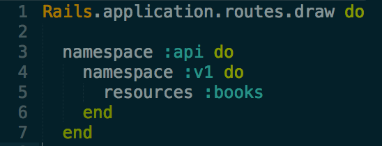
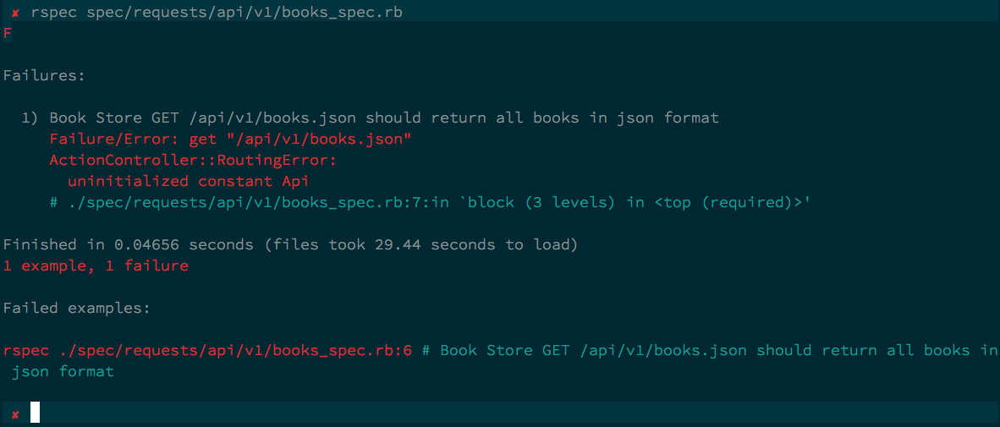

> [<< BACK: 5. Write the first Request Spec](step-5-write-the-first-request-spec.md)

> [>> NEXT: 7. Implementing the first Controller](step-7-first-controller.md)

What are routes ? Routes are responsible for routing the requests to appropriate controller.

Let us define our first route

get     '/api/v1/books'           => "api/v1/books#index",    as: api_v1_books

get     '/api/v1/books'           => "api/v1/books#index",    as: api_v1_books
  get     '/api/v1/books/:id'       => "api/v1/books#show",     as: api_v1_book
  get     '/api/v1/books/new'       => "api/v1/books#new",      as: new_api_v1_book
  post    '/api/v1/books'           => "api/v1/books#create",   as: api_v1_books

  get     '/api/v1/books/edit/:id'  => "api/v1/books#edit",     as: edit_api_v1_book
  post    '/api/v1/books/:id'       => "api/v1/books#update",   as: api_v1_book
  delete  '/api/v1/books/:id'       => "api/v1/books#destroy",  as: api_v1_book

Rails provide us a helful method which does this for us.

Now run it again

$ rspec spec/requests/api/v1/books_spec.rb

Let us inspect the error

'uninitialized constant Api'

> [<< BACK: 5. Write the first Request Spec](step-5-write-the-first-request-spec.md)

> [>> NEXT: 7. Implementing the first Controller](step-7-first-controller.md)
